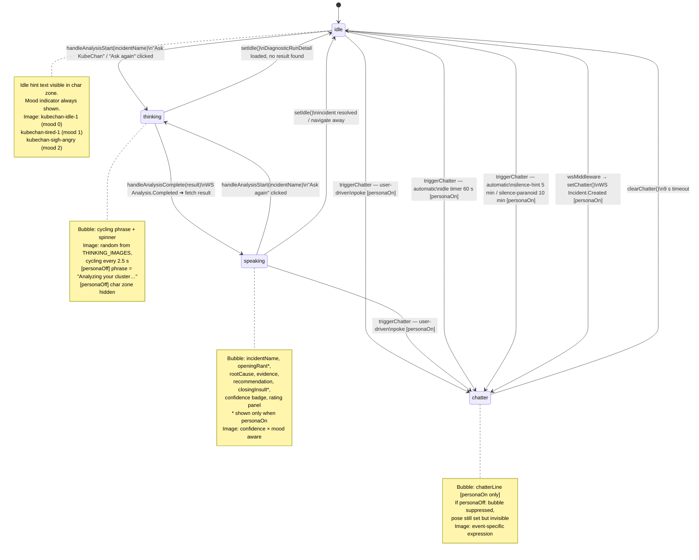

# KubeChan Sidebar — FSM & Expression Design

## State diagram



> **`reactionLine` is orthogonal** — a callout bubble overlaid on the character image, independent of pose. Set by `setReaction(line)`, auto-cleared after 4.5 s.

---

## Event → reaction map

| Event | Trigger | Pose after | Expression image | Reaction / text |
|-------|---------|------------|-----------------|-----------------|
| `handleAnalysisStart` | "Ask KubeChan" click | `thinking` | cycling THINKING_IMAGES | cycling THINKING_PHRASES |
| `handleAnalysisComplete` (normal) | WS + fetch | `speaking` | confidence×mood (`charImage`) | — |
| `handleAnalysisComplete` (false-alarm) | WS + fetch, `suggestExclusionRule` set | `speaking` | `kubechan-facepalm-angry` or `kubechan-facepalm-calm` | `reactionLine` ← `false-alarm` line |
| `poke` (1–2×) | click image | `chatter` | `kubechan-rolleye` | `poke` line |
| `poke-annoyed` (3–4×) | click image | `chatter` | `kubechan-sigh-angry` | `poke-annoyed` line |
| `poke-rage` (5×+) | click image | `chatter` | `kubechan-sigh-angry` (+ shake) | `poke-rage` line |
| `rating-up` | 👍 click (conf < 0.75) | `speaking` | — | `reactionLine` ← `rating-up` line |
| `rating-up-flustered` | 👍 click (conf ≥ 0.75) | `speaking` | — | `reactionLine` ← `rating-up-flustered` line |
| `rating-down-low-conf` | 👎 click (conf < 0.75) | `speaking` | — | `reactionLine` ← `rating-down-low-conf` line |
| `rating-down-high-conf` | 👎 click (conf ≥ 0.75) | `speaking` | — | `reactionLine` ← `rating-down-high-conf` line |
| `new-incident` | WS Incident.Created | `chatter` | `kubechan-looking-3` | `new-incident` line |
| `incident-resolved` | resolve click | `chatter` | `kubechan-pray-calm` | `incident-resolved` line |
| `idle` timer (60 s) | interval | `chatter` | `kubechan-idle-1` | `idle` line |
| `silence-hint` (5 min) | interval | `chatter` | `kubechan-looking` | `silence-hint` line |
| `silence-paranoid` (10 min) | interval | `chatter` | `kubechan-looking-2` | `silence-paranoid` line |
| `nav-incidents` | NavLink click | `chatter` | `kubechan-idle-1` | `nav-incidents` line |
| `nav-diagnostics` | NavLink click | `chatter` | `kubechan-looking` | `nav-diagnostics` line |
| `open-run` | DR detail loaded | `chatter` | `kubechan-looking-2` | `open-run` line |
| `many-incidents` | list loads, count > threshold | `chatter` | `kubechan-sigh-angry` (mood 2) / `kubechan-tired-1` (mood 1) | `many-incidents` line |
| `no-incidents` | list loads, empty | `chatter` | `kubechan-pray-calm` | `no-incidents` line |
| `false-alarm` (reaction) | `suggestExclusionRule` in result | `speaking` (reactionLine only) | (reaction callout, no image change) | `false-alarm` line |
| `exclusionRuleCreated` | rule created | `chatter` | `kubechan-rolleye` | `exclusionRuleCreated` line |
| `exclusionRulesEmpty` | rules page loads, empty | `chatter` | `kubechan-idle-1` | `exclusionRulesEmpty` line |
| `dismissed-analysis` | close/navigate mid-analysis | `chatter` | `kubechan-sigh-calm` | `dismissed-analysis` line |
| `delete-run` | delete DR | `chatter` | `kubechan-facepalm-calm` | `delete-run` line |

---

## Proposed expression system extension

Currently `setChatter(line)` only carries the text line. To add per-event images we extend the slice and chatter module:

### 1 — `pickChatterExpression(event)` in `chatter.ts`

```ts
const EXPRESSIONS: Partial<Record<ChatterEvent, string>> = {
  'poke':                    '/kubechan-rolleye.png',
  'poke-annoyed':            '/kubechan-sigh-angry.png',
  'poke-rage':               '/kubechan-sigh-angry.png',
  'new-incident':            '/kubechan-looking-3.png',
  'incident-resolved':       '/kubechan-pray-calm.png',
  'silence-hint':            '/kubechan-looking.png',
  'silence-paranoid':        '/kubechan-looking-2.png',
  'idle':                    '/kubechan-idle-1.png',
  'nav-incidents':           '/kubechan-idle-1.png',
  'nav-diagnostics':         '/kubechan-looking.png',
  'open-run':                '/kubechan-looking-2.png',
  'many-incidents':          '/kubechan-sigh-angry.png',
  'no-incidents':            '/kubechan-pray-calm.png',
  'false-alarm':             '/kubechan-facepalm-calm.png',
  'exclusionRuleCreated':    '/kubechan-rolleye.png',
  'exclusionRulesEmpty':     '/kubechan-idle-1.png',
  'dismissed-analysis':      '/kubechan-sigh-calm.png',
  'delete-run':              '/kubechan-facepalm-calm.png',
  'rating-up':               '/kubechan-pray-calm.png',
  'rating-up-flustered':     '/kubechan-pray-cry.png',
  'rating-down-high-conf':   '/kubechan-sigh-angry.png',
  'rating-down-low-conf':    '/kubechan-sigh-calm.png',
}

export function pickChatterExpression(event: ChatterEvent): string {
  return EXPRESSIONS[event] ?? '/kubechan-idle-1.png'
}
```

### 2 — extend `KubeChanState` and `setChatter` action

```ts
// kubechanSlice.ts
interface KubeChanState {
  // ... existing
  chatterImage?: string   // ← new: expression image for current chatter
}

setChatter: (state, action: PayloadAction<{ line: string; image?: string }>) => {
  state.pose = 'chatter'
  state.chatterLine = action.payload.line
  state.chatterImage = action.payload.image
},
clearChatter: (state) => {
  if (state.pose === 'chatter') state.pose = 'idle'
  state.chatterLine = undefined
  state.chatterImage = undefined
},
```

### 3 — `showChatter` in `useKubeChan.ts`

```ts
const showChatter = useCallback((line: string, image?: string) => {
  dispatch(setChatter({ line, image }))
  // ... timer unchanged
}, [dispatch])

const triggerChatter = useCallback((event: ChatterEvent) => {
  // ... guards unchanged
  showChatter(
    pickChatterLine(event, moodLevelRef.current),
    pickChatterExpression(event),
  )
}, [showChatter])
```

### 4 — `KubeChanSidebar` uses `chatterImage` for `imgSrc`

```ts
// in component, replace the imgSrc derivation:
const { pose, result, incidentName, reactionLine, chatterLine, chatterImage } = state

const imgSrc = pose === 'thinking'
  ? thinkingImg
  : pose === 'chatter' && chatterImage
    ? chatterImage
    : hasFalseAlarm
      ? falseAlarmImg
      : '/kubechan-idle-1.png'
```

---

## Available image assets

| File | Emotion / use |
|------|--------------|
| `kubechan-idle-1.png` | neutral, waiting |
| `kubechan-looking.png` | curious, paying attention |
| `kubechan-looking-2.png` | suspicious, uncertain |
| `kubechan-looking-3.png` | alert, something happened |
| `kubechan-pray-calm.png` | relieved, pleased, high confidence |
| `kubechan-pray-cry.png` | overwhelmed gratitude (flustered by good rating) |
| `kubechan-pray-scream.png` | panic, screaming |
| `kubechan-rolleye.png` | dismissive, eye-roll |
| `kubechan-sigh-calm.png` | tired acceptance, mild disappointment |
| `kubechan-sigh-angry.png` | angry, frustrated, rage |
| `kubechan-tired-1.png` | worn out, irritated (mood 1) |
| `kubechan-facepalm-calm.png` | calm disbelief |
| `kubechan-facepalm-angry.png` | angry disbelief |
| `kubechan-facepalm-very-calm.png` | deep facepalm, total resignation |
| `kubechan-playful.png` | playful, teasing |
