# Phase 8 — KubeChan UX Overhaul: Analysis Result on Card + FSM Redesign

## Summary

Two tightly coupled frontend changes that fix the fundamental design tension in the current
sidebar implementation:

**Problem A — Analysis result lives in the wrong place.**
Root cause, evidence, recommendation, confidence, and the rating panel are rendered inside
KubeChan's speech bubble. This means the technical content disappears when KubeChan
transitions to a different pose, forces `speaking` to be a permanent state with no natural
exit, and buries actionable information inside a character animation widget.

**Problem B — The `speaking` pose has no lifecycle.**
Once `handleAnalysisComplete` fires, KubeChan stays in `speaking` forever — no auto-clear,
no clean handoff. The only way out is navigating away or the user clicking "Ask again".

**Solution:**
- Move all technical content (root cause, evidence, recommendation, confidence, rating) into
  the `IncidentCard` → `IncidentDetails` accordion as a persistent "Analysis" section.
- `speaking` becomes a short-lived personality delivery pose: KubeChan shows her
  `openingRant` + `closingInsult` in the bubble, then **auto-clears in 8 seconds**.
- The expression system (`chatterImage` per event) is implemented alongside, since the
  pose lifecycle changes require touching the same slice/hook/sidebar files.

---

## Prerequisites

- Phase 7 complete (exclusion rules + smart evidence fully merged).
- All existing sidebar tests and `handler` tests passing.

---

## Design decisions

### Where does the result live?

| Content | Before | After |
|---------|--------|-------|
| `openingRant` | sidebar bubble | sidebar bubble (unchanged) |
| `closingInsult` | sidebar bubble | sidebar bubble (unchanged) |
| Root cause | sidebar bubble | IncidentCard → Analysis accordion |
| Evidence chain | sidebar bubble | IncidentCard → Analysis accordion |
| Recommendation | sidebar bubble | IncidentCard → Analysis accordion |
| Confidence badge | sidebar bubble | IncidentCard → Analysis accordion |
| Model name | sidebar bubble | IncidentCard → Analysis accordion |
| Rating panel (👍/👎) | sidebar bubble | IncidentCard → Analysis accordion |

### Lazy fetch on card

`DiagnosticRunSummary` (used by the incident list query) carries `likelyRootCause`,
`evidenceChain`, and `recommendation` only in the full `AnalysisResult`. Rather than
bloating the list API, the Analysis accordion fetches the full result on first expand using
the existing `/api/v1/diagnosticruns/{id}/analysisresult` endpoint.

The result is cached in local component state — re-expanding does not re-fetch.

### `speaking` pose auto-clear

`handleAnalysisComplete` dispatches `setSpeaking` as today. A new 8-second timer in
`useKubeChan` fires `setIdle` automatically. If the user clicks "Ask again" before the
timer expires, the timer is cancelled and `thinking` starts cleanly.

When persona is **off**: the bubble shows a brief neutral line ("Analysis complete.") and
also auto-clears in 8 seconds. The card receives the result regardless.

### Expression system (`chatterImage`)

Implemented in the same pass since it requires the same slice/hook/sidebar changes. Each
`ChatterEvent` maps to a specific character image. The image travels through
`setChatter({ line, image })` and is used as `imgSrc` during the `chatter` pose.

---

## Revised FSM

```mermaid
stateDiagram-v2
    direction TB

    [*] --> idle

    %% ── Analysis flow ──────────────────────────────────────────────────────────
    idle     --> thinking : ANALYSIS_START\n"Ask KubeChan" / "Ask again" clicked\naction: setIncidentName, spinner on
    speaking --> thinking : ANALYSIS_START\n"Ask again" while rant still showing\naction: cancel rant timer, restart

    thinking --> speaking : ANALYSIS_COMPLETE(result)\nWS Analysis.Completed → fetch full result\naction: push result to card; show rant+insult in bubble
    thinking --> idle     : ANALYSIS_FAILED / DISMISSED\nDR page loads with no result\naction: clear incidentName

    speaking --> idle     : RANT_EXPIRED\nauto after 8 s [always]\naction: clearSpeaking; card already has result

    speaking --> idle     : USER_DISMISS\nclick bubble X [personaOff: immediately]\naction: clearSpeaking

    %% ── Chatter flow ───────────────────────────────────────────────────────────
    idle     --> chatter  : CHATTER_EVENT [personaOn]\ntriggerChatter: poke / idle-timer / nav / new-incident / …\naction: setChatterLine + chatterImage; start 9 s timer
    speaking --> chatter  : CHATTER_EVENT [personaOn]\ntriggerChatter: poke only (guards block all automatic events)\naction: interrupt rant, show chatter; restart 9 s timer

    chatter  --> idle     : CHATTER_EXPIRED\nauto after 9 s [always]\naction: clearChatter

    chatter  --> chatter  : CHATTER_EVENT [personaOn]\nnew event while chatter showing\naction: replace line + image; reset 9 s timer

    %% ── Idle result load ───────────────────────────────────────────────────────
    idle     --> idle     : RESULT_LOADED\nDR detail page opened, result already in DB\naction: push result to card only — no pose change

    %% ── Notes ──────────────────────────────────────────────────────────────────
    note right of idle
      Image: kubechan-idle-1 (mood 0)
             kubechan-tired-1 (mood 1)
             kubechan-sigh-angry (mood 2)
      Hint text: "click an incident to ask me for help"
    end note

    note right of thinking
      Image: paired THINKING_FRAMES cycling every 2.5 s (fade swap)
      Bubble: matching phrase per frame
      [personaOff] phrase = "Analyzing your cluster…"
      [personaOff] char zone hidden
    end note

    note right of speaking
      Bubble [personaOn]:  openingRant  +  closingInsult only
      Bubble [personaOff]: "Analysis complete." (neutral)
      Card:  root cause, evidence, recommendation,
             confidence badge, model, rating panel
      Auto-clears in 8 s regardless of persona flag
      Image: false-alarm → facepalm; else mood×confidence charImage
    end note

    note right of chatter
      Bubble [personaOn]: chatterLine only
      [personaOff]: pose set in state, bubble suppressed
      Image: event-specific chatterImage
      Auto-clears in 9 s
    end note
```



### Orthogonal layers

```
reactionLine  ──── overlay callout rendered on top of char image
                   set by setReaction(line), auto-clears after 4.5 s
                   fires on: rating events, false-alarm detect

cardResult    ──── AnalysisResult stored in IncidentCard local state
                   pushed on ANALYSIS_COMPLETE or lazy-fetched on accordion open
                   persists across all pose transitions
```

---

## Event → expression map

| Event | Pose after | Expression image | Source |
|-------|------------|-----------------|--------|
| `handleAnalysisStart` | `thinking` | cycling THINKING_FRAMES[i].image | `KubeChanSidebar` |
| `handleAnalysisComplete` (normal) | `speaking` → `idle` (8 s) | `kubechan-pray-calm` (high conf) / `kubechan-idle-1` | `useKubeChan` |
| `handleAnalysisComplete` (false-alarm) | `speaking` → `idle` (8 s) | `kubechan-facepalm-angry` or `kubechan-facepalm-calm` (random) | `useKubeChan` |
| `poke` (1–2×) | `chatter` | `kubechan-rolleye` | `useKubeChan` |
| `poke-annoyed` (3–4×) | `chatter` | `kubechan-sigh-angry` | `useKubeChan` |
| `poke-rage` (5×+) | `chatter` | `kubechan-sigh-angry` (+ shake) | `useKubeChan` |
| `rating-up` | `speaking` (reactionLine) | — | `useKubeChan` |
| `rating-up-flustered` | `speaking` (reactionLine) | — | `useKubeChan` |
| `rating-down-low-conf` | `speaking` (reactionLine) | — | `useKubeChan` |
| `rating-down-high-conf` | `speaking` (reactionLine) | — | `useKubeChan` |
| `new-incident` | `chatter` | `kubechan-looking-3` | `wsMiddleware` |
| `incident-resolved` | `chatter` | `kubechan-pray-calm` | `useKubeChan` |
| `idle` timer (60 s) | `chatter` | `kubechan-idle-1` | `useKubeChan` |
| `silence-hint` (5 min) | `chatter` | `kubechan-looking` | `useKubeChan` |
| `silence-paranoid` (10 min) | `chatter` | `kubechan-looking-2` | `useKubeChan` |
| `nav-incidents` | `chatter` | `kubechan-idle-1` | `useKubeChan` |
| `nav-diagnostics` | `chatter` | `kubechan-looking` | `useKubeChan` |
| `open-run` | `chatter` | `kubechan-looking-2` | `useKubeChan` |
| `many-incidents` | `chatter` | `kubechan-sigh-angry` (mood 2) / `kubechan-tired-1` (mood 1) | `useKubeChan` |
| `no-incidents` | `chatter` | `kubechan-pray-calm` | `useKubeChan` |
| `exclusionRuleCreated` | `chatter` | `kubechan-rolleye` | `useKubeChan` |
| `exclusionRulesEmpty` | `chatter` | `kubechan-idle-1` | `useKubeChan` |
| `dismissed-analysis` | `chatter` | `kubechan-sigh-calm` | `useKubeChan` |
| `delete-run` | `chatter` | `kubechan-facepalm-calm` | `useKubeChan` |

---

## Critical path

```
8.1 (slice: chatterImage + speaking auto-clear)
  → 8.2 (useKubeChan: rant timer + expression wiring)
    → 8.3 (KubeChanSidebar: strip technical content, add chatterImage imgSrc, dismiss button)
      → 8.4 (IncidentCard: Analysis accordion with lazy fetch + rating panel)
        → 8.5 (wsMiddleware: pass image through setChatter)
          → 8.6 (chatter.ts: pickChatterExpression)
```

8.5 and 8.6 can be done in parallel with 8.3 since they only touch their own files.

---

## Tasks

---

### [8.1] Redux slice — `chatterImage` + `speakingAutoCleared` (~30 min)

**File:** `services/frontend-ui/src/store/slices/kubechanSlice.ts`

**Changes:**

1. Extend `KubeChanState` interface:
```ts
interface KubeChanState {
  pose: KubeChanPose
  moodLevel: number
  incidentName?: string
  result?: AnalysisResult
  chatterLine?: string
  chatterImage?: string    // ← new: expression image for current chatter pose
  reactionLine?: string
}
```

2. Update `setChatter` action payload from `PayloadAction<string>` to
   `PayloadAction<{ line: string; image?: string }>`:
```ts
setChatter: (state, action: PayloadAction<{ line: string; image?: string }>) => {
  state.pose = 'chatter'
  state.chatterLine = action.payload.line
  state.chatterImage = action.payload.image
},
clearChatter: (state) => {
  if (state.pose === 'chatter') state.pose = 'idle'
  state.chatterLine = undefined
  state.chatterImage = undefined
},
```

3. Export a new `selectChatterImage` selector.

**Why:** All downstream changes depend on the slice shape being correct first.

---

### [8.2] `useKubeChan` — rant auto-clear timer + expression wiring (~1h)

**File:** `services/frontend-ui/src/hooks/useKubeChan.ts`

**Changes:**

1. `handleAnalysisComplete`: after dispatching `setSpeaking`, start an 8-second timer
   that dispatches `setIdle()`. Store the timer ID in a ref. Cancel on component unmount
   or if `handleAnalysisStart` fires before expiry.

```ts
const rantTimerRef = useRef<ReturnType<typeof setTimeout> | null>(null)

// inside handleAnalysisComplete:
if (rantTimerRef.current) clearTimeout(rantTimerRef.current)
rantTimerRef.current = setTimeout(() => {
  dispatch(setIdle())
  rantTimerRef.current = null
}, 8000)

// inside handleAnalysisStart: cancel rant timer
if (rantTimerRef.current) {
  clearTimeout(rantTimerRef.current)
  rantTimerRef.current = null
}
```

2. Import `pickChatterExpression` from `chatter.ts` (implemented in 8.6) and pass it
   through `showChatter`:

```ts
const showChatter = useCallback((line: string, image?: string) => {
  dispatch(setChatter({ line, image }))
  // existing 9 s clear timer unchanged
}, [dispatch])

const triggerChatter = useCallback((event: ChatterEvent) => {
  // existing guards unchanged
  showChatter(
    pickChatterLine(event, moodLevelRef.current),
    pickChatterExpression(event),
  )
}, [showChatter])
```

3. `handleIncidentResolved`: currently dispatches `setIdle`. Change to call
   `triggerChatter('incident-resolved')` instead (so it picks the `pray-calm` image and
   shows the resolved line as chatter, then auto-clears).

---

### [8.3] `KubeChanSidebar` — strip technical content, add chatterImage, dismiss (~1h)

**File:** `services/frontend-ui/src/components/KubeChanSidebar.tsx`

**Changes:**

1. **Strip `speaking` bubble content.** Remove `rootCause`, `evidenceChain`,
   `recommendation` renders from the bubble. The `speaking` bubble should only contain:
   - `incidentName` label (brief orientation)
   - `openingRant` (personaOn only)
   - `closingInsult` (personaOn only)
   - When personaOff: single neutral line `"Analysis complete. Check the incident card."`
   - Remove the rating panel from the bubble entirely.
   - Remove `speech-meta` (confidence badge, model) from bubble.

2. **Add dismiss button.** Small `×` button in the bubble header so the user can manually
   clear the `speaking` bubble before the 8 s timer fires. Calls `onDismiss` prop.
   When personaOff: clicking dismiss fires immediately with no timer.

   ```tsx
   // new prop:
   onDismiss?: () => void
   // renders inside bubble header:
   <button className="bubble-dismiss" onClick={onDismiss} aria-label="Dismiss">×</button>
   ```

3. **`chatterImage` in `imgSrc`.** Destructure `chatterImage` from `state` and use it:
   ```ts
   const imgSrc = pose === 'thinking'
     ? THINKING_FRAMES[thinkingFrameIdx].image
     : pose === 'chatter' && chatterImage
       ? chatterImage
       : hasFalseAlarm
         ? falseAlarmImg
         : '/kubechan-idle-1.png'
   ```

4. **Wire `onDismiss` from `App.tsx`** — pass `handleDismiss` (new export from
   `useKubeChan` that clears the rant timer and dispatches `setIdle`).

---

### [8.4] `IncidentCard` / `IncidentDetails` — Analysis accordion + rating panel (~2h)

**File:** `services/frontend-ui/src/pages/incidents/IncidentList.tsx`

**Changes:**

1. **New "Analysis" section inside `IncidentDetails` accordion.**
   Shown only when `previousRun?.analysisResultId` exists.
   Initially collapsed with label "Analysis result".

2. **Lazy fetch on first expand.**
   `IncidentDetails` gets a new internal state:
   ```ts
   const [analysisResult, setAnalysisResult] = useState<AnalysisResult | null>(null)
   const [analysisLoading, setAnalysisLoading] = useState(false)
   const [analysisOpen, setAnalysisOpen] = useState(false)
   ```
   On expand (`analysisOpen` flips to `true`), if `analysisResult` is null, fetch:
   ```ts
   GET /api/v1/diagnosticruns/{previousRun.id}/analysisresult
   ```
   Uses the existing `getToken()` helper for auth header. Cache in state — re-expand does
   not re-fetch.

3. **Analysis section content** (shown after fetch):
   ```
   [confidence badge]  [model name]  [timestamp]

   Root cause
   <likelyRootCause>

   Evidence
   <evidenceChain>

   Recommendation
   <recommendation>

   [Was this correct?]  [👍 Correct]  [👎 Wrong]
   ```
   Rating buttons call `onRate` prop (existing). Disabled + label updated when
   `userRating` is set (use `previousRun.userRating` or local optimistic state).

4. **Pass `onRate` prop down to `IncidentDetails`.**
   `IncidentDetails` currently receives no `onRate`. Add it:
   ```ts
   interface IncidentDetailsProps {
     incident: Incident
     previousRun?: DiagnosticRunSummary
     onRate?: (runId: string, rating: 'up' | 'down', confidence: number) => void
   }
   ```
   `IncidentCard` already has `onRate` from `useKubeChan().handleRate` — pass it through.

5. **Remove rating panel from `KubeChanSidebar` bubble** (done in 8.3, referenced here
   for clarity).

---

### [8.5] `wsMiddleware` — pass image through `setChatter` (~20 min)

**File:** `services/frontend-ui/src/store/middleware/wsMiddleware.ts`

Currently on `Incident.Created` the middleware dispatches:
```ts
dispatch(setChatter(line))
```

After 8.1 changes `setChatter` payload to `{ line, image }`, update to:
```ts
import { pickChatterExpression } from '../../persona/chatter'
// ...
dispatch(setChatter({ line, image: pickChatterExpression('new-incident') }))
```

This is the only direct `setChatter` call outside `useKubeChan`. All other chatter
events go through `triggerChatter` which already passes the image after 8.2.

---

### [8.6] `chatter.ts` — `pickChatterExpression` (~20 min)

**File:** `services/frontend-ui/src/persona/chatter.ts`

Add the expression map and export function:

```ts
const EXPRESSIONS: Partial<Record<ChatterEvent, string>> = {
  'poke':                    '/kubechan-rolleye.png',
  'poke-annoyed':            '/kubechan-sigh-angry.png',
  'poke-rage':               '/kubechan-sigh-angry.png',
  'new-incident':            '/kubechan-looking-3.png',
  'incident-resolved':       '/kubechan-pray-calm.png',
  'silence-hint':            '/kubechan-looking.png',
  'silence-paranoid':        '/kubechan-looking-2.png',
  'idle':                    '/kubechan-idle-1.png',
  'nav-incidents':           '/kubechan-idle-1.png',
  'nav-diagnostics':         '/kubechan-looking.png',
  'open-run':                '/kubechan-looking-2.png',
  'many-incidents':          '/kubechan-sigh-angry.png',
  'no-incidents':            '/kubechan-pray-calm.png',
  'false-alarm':             '/kubechan-facepalm-calm.png',
  'exclusionRuleCreated':    '/kubechan-rolleye.png',
  'exclusionRulesEmpty':     '/kubechan-idle-1.png',
  'dismissed-analysis':      '/kubechan-sigh-calm.png',
  'delete-run':              '/kubechan-facepalm-calm.png',
  'rating-up':               '/kubechan-pray-calm.png',
  'rating-up-flustered':     '/kubechan-pray-cry.png',
  'rating-down-high-conf':   '/kubechan-sigh-angry.png',
  'rating-down-low-conf':    '/kubechan-sigh-calm.png',
}

export function pickChatterExpression(event: ChatterEvent): string {
  return EXPRESSIONS[event] ?? '/kubechan-idle-1.png'
}
```

---

## Files changed summary

| File | Change |
|------|--------|
| `src/store/slices/kubechanSlice.ts` | Add `chatterImage` field; update `setChatter`/`clearChatter` payload |
| `src/hooks/useKubeChan.ts` | Add `rantTimerRef` + 8 s auto-clear; pass `chatterImage` through `showChatter`/`triggerChatter`; update `handleIncidentResolved` |
| `src/components/KubeChanSidebar.tsx` | Strip technical content from `speaking` bubble; add dismiss button + `onDismiss` prop; use `chatterImage` in `imgSrc` |
| `src/pages/incidents/IncidentList.tsx` | Add Analysis accordion to `IncidentDetails` with lazy fetch, full result display, and rating panel |
| `src/store/middleware/wsMiddleware.ts` | Update `setChatter` call to `{ line, image }` shape |
| `src/persona/chatter.ts` | Add `pickChatterExpression` export |
| `src/App.tsx` | Pass `onDismiss` to `KubeChanSidebar` |

**No backend changes required.** The existing
`GET /api/v1/diagnosticruns/{id}/analysisresult` endpoint serves all card content.

---

## Out of scope for this phase

- `charImage` function (confidence × mood aware image for `speaking` pose) — deferred
- Pose-transition animations (fade, slide) — deferred
- CSS styling of the new Analysis accordion section — in scope but not specified here;
  follow existing `IncidentDetails` MUI patterns
